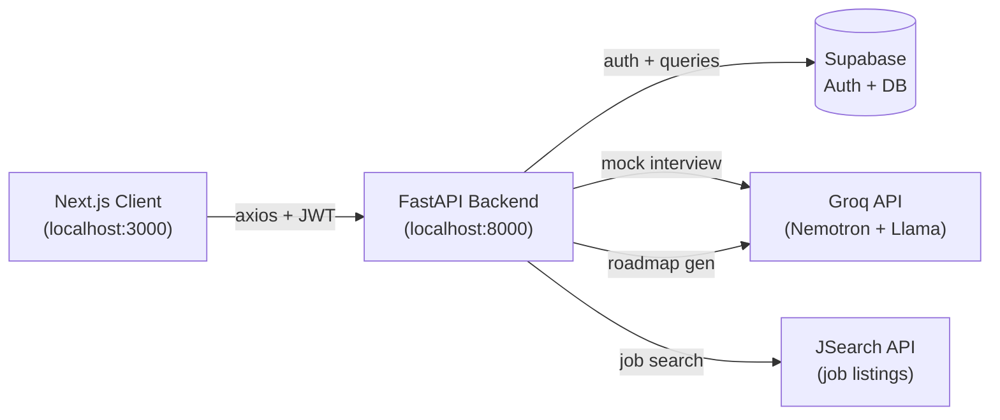

<div align="center">

# CareerOS

Career, learning, and internship platform for students and job seekers.


[](https://github.com/YOUR_ORG/careeros/actions)
[](https://nextjs.org)
[](https://fastapi.tiangolo.com)
[](https://supabase.com)
[](LICENSE)

</div>

## 🚀 Quick Start

```bash
# 1. Clone
git clone https://github.com/YOUR_ORG/careeros.git && cd careeros

# 2. Install dependencies
npm install --prefix frontend
uv pip install -r backend/requirements.txt

# 3. Start both servers (two terminals)
npm run dev --prefix frontend     # → http://localhost:3000
uvicorn backend.main:app --reload # → http://localhost:8000
```

Copy `.env.example` to `.env` in `backend/` and `frontend/`, then add your Supabase project URL and anon key, plus a JSearch API key for the job board. No Docker, no external orchestrator — just Node.js 20+ and Python 3.12+.

## ✨ Key Features

- **🎯 Multi-Factor Job Matching** — Searches live jobs from the JSearch API with cache-first lookups. Filter by job type (full-time, internship, contract) and remote preference. Save jobs to a personal list, track applications with timestamps, and get relevance-matched results based on your resume skills. Pagination keeps results browsable, not a firehose.
- **📊 Student Dashboard & ATS** — Upload a PDF resume and get it parsed into structured sections (experience, education, projects, skills) using PyMuPDF extraction and prompt-based structuring. The ATS module scores your resume against standard criteria and gives section-by-section suggestions — what to add, what to rephrase, where you are weak compared to industry parsing expectations.
- **📝 Interactive Quiz LMS** — Take timed quizzes across DSA, CS fundamentals, aptitude, and verbal topics. Each quiz has a configurable question count and time limit. Get scored instantly with a breakdown of correct vs incorrect answers and explanations for every question you missed. Questions live in a structured pool so adding new topics is a data operation, not a code change.
- **🤖 AI Mock Interview** — Practice interviews powered by Nemotron (served through Groq). The AI asks questions, listens to your spoken response via browser audio, transcribes it, and scores each answer on relevance, completeness, and timing. You get per-question feedback and an overall readiness score at the end. No scheduled slots, no interviewer needed.
- **🧭 AI Roadmap Generator** — Type in any topic (DSA, Python, System Design, React, etc.) and get a structured learning roadmap with categories, topics, durations, and learning resources. Uses Groq (`llama-3.3-70b-versatile`) to generate descriptions and resources within hardcoded category templates for 11 known topics (DSA, Python, System Design, JavaScript, React, ML, OS, DBMS, CN, Java, Kotlin). Unknown topics fall back to AI-generated categories. Roadmaps are saved to Supabase and viewable in a card-based horizontal layout with expandable categories and inline topic detail panels.
- **🔐 Auth & Profiles** — Email-based authentication through Supabase with JWT session handling. After signup, create a profile with your name, college, branch, graduation year, and a skills list. The JWT is auto-attached to every API request by an axios interceptor — no manual token management on the frontend.

## 🏗️ Architecture



The Next.js client talks to the FastAPI backend over plain HTTP (local dev). Every request automatically carries a Supabase JWT in the `Authorization` header — the axios interceptor reads the token from `localStorage` and attaches it, so individual API calls never worry about auth state.

The backend routes dispatch to six service modules:

- **Auth** — signup, login, session refresh, and profile CRUD against Supabase Auth + the `profiles` table.
- **Resume ATS** — accepts a PDF, extracts text with PyMuPDF, then uses a prompt chain (OpenAI/Groq) to split the content into structured sections and compute an ATS score.
- **Quiz LMS** — CRUD for quiz questions and attempts. Each attempt is timed; the scoring endpoint compares answers and returns a right/wrong breakdown with per-question explanations.
- **AI Interview** — generates interview questions via Nemotron (Groq), captures browser audio on the frontend, sends it for transcription, and scores each response using a rubric prompt.
- **Jobs Board** — proxies the JSearch API with a two-tier cache: `search_cache` maps query hashes to job ID arrays, `jobs_cache` stores deduplicated job records. Cache TTL is 24 hours. Supports save/unsave and apply tracking in dedicated Supabase tables.
- **Roadmap Generator** — accepts a topic and optional target role, dispatches to Groq to generate learning content within locked category templates, validates and retries on failure, and persists the result to the `roadmaps` Supabase table.

Nemotron (accessed through the Groq API) handles interview dialogue generation and response scoring. The JSearch API (OpenWebNinja) supplies live job listings. Both are configured via `.env` — no hardcoded keys.

## 🛠️ Tech Stack

**Frontend** — Next.js 14 with App Router, React 18, TypeScript, Tailwind CSS 3.4. State management via Zustand. HTTP client is Axios with an auto-auth interceptor. Framer Motion handles page transitions and micro-interactions. React Hook Form manages form state with validation. Lucide React provides the icon set. Anime.js powers the landing page hero animation.

**Backend** — FastAPI with Pydantic v2 models and automatic OpenAPI docs at `/docs`. Uvicorn is the dev server. Auth tokens are handled with python-jose (JWT encode/decode). Async HTTP calls (JSearch API, Groq) go through HTTPX. Resume PDFs are parsed with PyMuPDF. AI prompts use the OpenAI SDK (compatible with Groq's endpoint) and the Groq SDK directly for low-latency inference.

**Infrastructure** — Supabase provides authentication (email/password, JWT session management) and the PostgreSQL database. The client library (`supabase>=2.4.0`) connects from the backend for direct DB access. The JSearch API (OpenWebNinja) powers the job board with a 24-hour cache layer. Groq serves Nemotron for mock interview inference. No Docker setup yet — run with Node.js 20+ and Python 3.12+ directly.

## 🤝 Contributing

1. Fork the repo and create a branch: `git checkout -b feature/your-idea`
2. Make your changes. Keep the README updated if you add a module.
3. Run linting: `npm run lint --prefix frontend` (no backend linter configured yet).
4. Open a pull request against `main`. Describe what it does and why.

## 📄 License

Distributed under the MIT License. See [LICENSE](LICENSE) for details.
